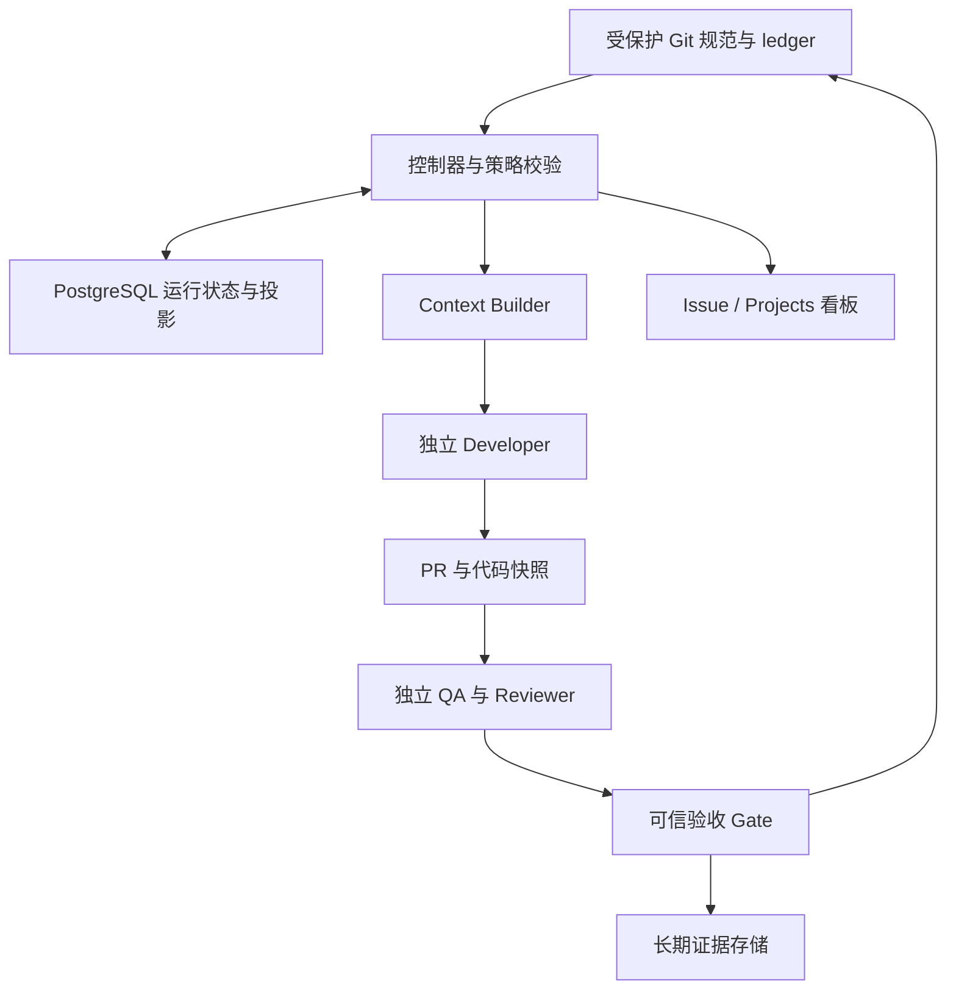

# 架构、权威与实现范围

目标是“Session 可以丢失，项目可以恢复”。实现方法不是保存无限聊天，而是保存可追溯的原文、版本化任务契约、执行事件和验收证据。

## 当前可运行的边界

本仓库交付一个 Go 可执行文件，内嵌 skill 与引用资料，包含项目安装/卸载和本地确定性 CLI。Agent 负责理解与规划，CLI 负责保存和检查结构化事实。没有模型 API、后台 worker、数据库服务或自动唤醒机制。

| 层 | 当前责任 |
|---|---|
| 来源 | requirement / constraint / ADR / design 的原文快照、版本摘要与批准记录 |
| 任务 | goal、依赖、scope、AC、验证命令、文件线索 |
| 执行 | claim / heartbeat / submit、失败与重试记录 |
| 工作区 | 用全局 `--worktree` 分离本机代码 checkout，共享 `--root` 的唯一账本与原文 |
| 上下文 | 从当前任务和关联来源构建角色包 |
| 证据 | 命令退出码、日志、指定版本上的 review 与验收记录 |
| 账本 | 单写者文件锁、逐事件 JSON、哈希链和可重建投影 |
| 协作 | GitHub 同步计划与显式执行入口 |

哈希链只能在可信参照存在时发现修改；能重写整个目录的人可以重写链条。本地锁是并发写入机制，不是身份授权机制，也不应作为跨机器分布式锁使用。

## 本机 worktree 执行模型

`projectctl --root /central/project --worktree /worker-checkout ...` 已可执行。工具检查两个路径的 `git-common-dir` 是否指向同一个目录；同一远端的独立 clone 不满足该约束。

| 数据或动作 | 使用位置 |
|---|---|
| 事件、任务、投影、来源原文与快照 | `--root` |
| 验证日志、上下文包和验收证据 | `--root` |
| Git HEAD、代码树和 clean checkout 检查 | `--worktree`，省略时使用 root |
| `verify` 启动命令的工作目录 | `--worktree`，省略时使用 root |

多个 Agent 可以同时开发不同任务，各自使用预先准备好的本机 worktree。共享账本的写入串行化，同一个任务仍有 attempt 与租约校验；不需要、也不应在多个分支复制活动账本。独立 QA 可以针对同一提交准备另一 worktree，并把相同 root 和 QA worktree 传给 context、verify、review 和 accept。

工具不会创建 worktree、clone、容器或沙箱。工作区与操作系统凭据仍由 Runner 管理，同一用户权限下的代码分离不构成强隔离。跨机器分布式多写者、网络共享盘协调和自动处理代码合并冲突尚未实现。

## 状态划分

| 状态 | 内容 | 会话丢失后 |
|---|---|---|
| Project State | 规范基线、批准决策、任务依赖、整体完成与阻塞情况 | 从来源与账本恢复 |
| Task State | 契约、attempt、租约、提交版本、AC 与证据 | 从任务事件恢复 |
| Session State | 检索过程、未保存草稿、临时推理、终端临时变量 | 可丢弃；重要产物必须写回 |

投影是读优化，不是另一份可独立编辑的真相。`rebuild` 从事件恢复投影，不会恢复本来就未保存的设计文档、源代码或证据。

来源或上下文过期通过 `status.problems` 及相关命令的 stale 错误显示，不另存 `STALE` 状态。纠正依据后，未完成任务通过 retry / revise 回到 `PROPOSED` 并重新准备。

## 防止失真的机制

1. 每次引用回到原始文档的精确版本，摘要只用来定位。
2. 稳定 ID 连接需求、约束、任务、代码 SHA、AC 和证据。
3. 原文发生变化需要重新批准；当前任务不能悄悄继续使用旧依据。
4. 验收绑定 attempt、代码与上下文，不把旧版本的 PASS 套到新版本。
5. 实现与设计冲突时形成待决项，不能让开发者同时改验收标准并宣布成功。

这些机制减少漂移，不能保证所有需求已被正确抽取或所有语义错误被发现。来源登记、测试充分性和跨模块影响仍需要工程判断。

## 百万行项目需要增加什么

先按业务模块和依赖边界组织规范与任务，再考虑检索规模。完整代码并不需要一次进入模型，但每项关键约束必须有可查入口。

生产演进可增加：AST / LSP 索引、调用与导入依赖、API / 数据表映射、关键词与向量混合检索、变更影响分析。关联边应注明来源和可信度：人工确认、静态分析确定、模型推断不能混为一类。语义检索只能召回候选，不能承担“所有约束都已找全”的保证。

## 长驻生产控制平面：后续扩展

以下是推荐架构，不是本仓库当前已经部署的功能。

Git ledger 保存权威业务事件；数据库负责队列、租约、幂等、重试与缓存；对象存储保存长期证据；Issue / Projects 展示状态。字段权威必须明确，跨系统更新通过可重试步骤与对账完成，不能假装多个 API 调用是同一事务。

生产验收需要不同凭据和运行环境：Developer 无权写最终 Gate，Reviewer 无权修改当前验收依据，控制器按确定性政策接收结果。新的模型或新会话减少上下文相关性，但仍不等于强身份隔离。

GitHub 的保护、webhook、merge queue 与保留期限制见 [GitHub 参考](../skills/github-project-control/references/github.md)。
